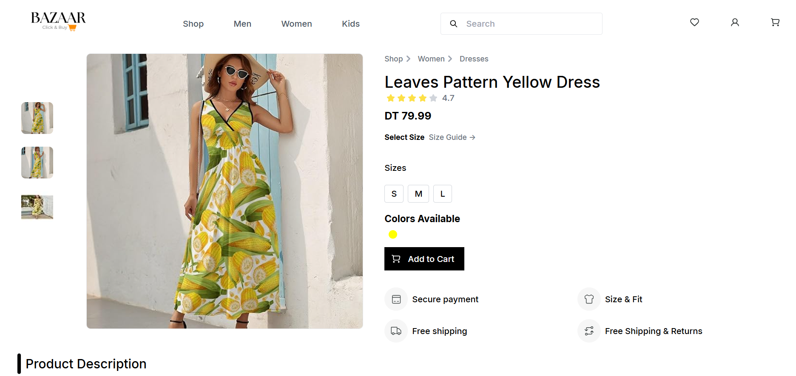

# 🛍️ Bazaar - Fullstack E-Commerce Project

  

---

Welcome to the **Fullstack E-Commerce Shopping Project** repository!  
This project is a work in progress and aims to build a comprehensive e-commerce application using **React.js** for the front-end and **Spring Boot** for the backend.  

Once completed, it will offer a complete online shopping experience with features like:  
- 🛒 Product browsing  
- 🛍️ Cart management  
- 📦 Order processing  

---

⚙️ Installation & Setup

 1️⃣ Clone the repository
    git clone https://github.com/fatenbrahmi/bazaar.git
   

 2️⃣ Start the Backend (Spring Boot)
    cd backend
    ./mvnw spring-boot:run

 3️⃣ Start the Frontend (React)
    cd frontend
    npm install
    npm start

🛠️ Technologies Being Used  

Frontend:  
  React  
  Redux  
  Tailwind CSS  
  Axios  

Backend:  
 Spring Boot  
 Spring Security  
 Spring Data JPA  

Database:  
 PostgreSQL  

Authentication:  
 JWT (JSON Web Tokens)  

Build Tools:  
 Maven  
 Webpack